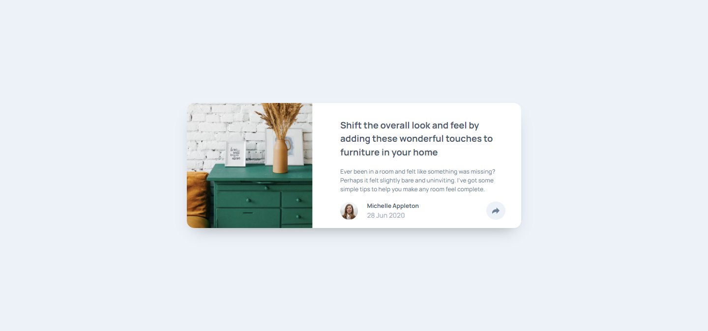
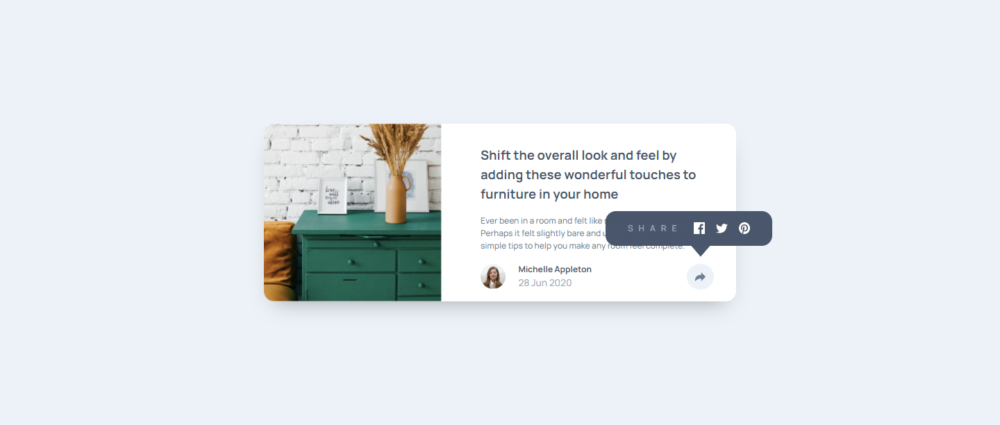
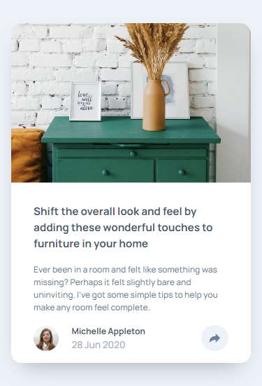
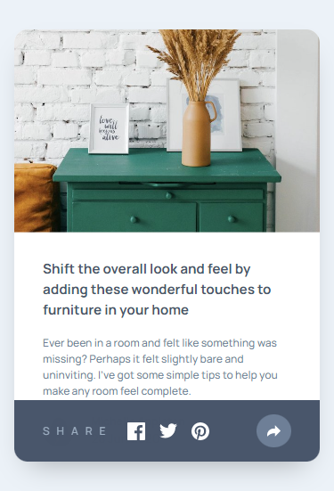

# Frontend Mentor - Article preview component solution

This is a solution to the [Article preview component challenge on Frontend Mentor](https://www.frontendmentor.io/challenges/article-preview-component-dYBN_pYFT). Frontend Mentor challenges help you improve your coding skills by building realistic projects. 

## Table of contents

- [Overview](#overview)
  - [The challenge](#the-challenge)
  - [Screenshot](#screenshot)
  - [Links](#links)
- [My process](#my-process)
  - [Built with](#built-with)
  - [What I learned](#what-i-learned)
  - [Continued development](#continued-development)
  - [Useful resources](#useful-resources)
- [Author](#author)


**Note: Delete this note and update the table of contents based on what sections you keep.**

## Overview

This was a very simple challenge. I took a mobile first approach to the design and made use of custom properties. I believe I got very close to the design and made the card functional like it should be. I'm happy with the way it turned out

### The challenge

Users should be able to:

- View the optimal layout for the component depending on their device's screen size
- See the social media share links when they click the share icon

### Screenshot

Desktop



Desktop active states



Mobile



Mobile active states



### Links

- Solution URL: [My Frontend Mentor Profile](https://www.frontendmentor.io/profile/dxiDavid)
- Live Site URL: [Go live](https://article-preview-component-1a5.pages.dev/)

## My process

### Built with

- Semantic HTML5 markup
- CSS custom properties
- Flexbox
- Mobile-first workflow

### What I learned

- I learned how to use clip paths to crop images and use a negative margin to correct its spaceing relative to other elements. It also creates interesting shapes.

```css
.share-text::after{
		content: "";
		position: absolute;
		bottom: -2rem;
		right: -2.65rem;
		background-color: var(--primary);
		padding: 1rem;
		clip-path: polygon(0% 0%, 100% 0, 100% 42%, 50% 100%, 0 42%);/*for the downward facing triangle on the pop-up*/
	}

.dresser{
  clip-path: polygon(0 0, 80% 0, 80% 100%, 0% 100%);/*for the image in desktop view*/
  margin-right: -4.5rem;
}

.dresser{
  clip-path: polygon(0 0%, 100% 0, 100% 83%, 0 83%);/*Dresser in mobile view*/
  margin-bottom: -3rem;
}

```
- I also learned how to implement a sequetial animation using the ```forEach()``` method.

```js

function fadeElements() {
    socials.forEach((element, index) => {
        element.style.animation = `sequetial-fade 0.3s ${index * 0.15}s ease forwards`;
    });
}

```

### Continued development

I'll come back and try the same thing with CSS and JS frameworks

### Useful resources

- [Youtube](https://www.youtube.com/@KevinPowell) - This is where I found the best tutorials and explanations (For me) on CSS concepts and      writing functional CSS. Kevin Powel really knows his stuff and gives concise explanations.
- [w3schools](https://w3schools.com) - This website has an entire course on JavaScript with simple examples for both basic and advanced concepts.
- [CSS Tricks](https://css-tricks.com/) - This website provides very well written explanations to CSS concepts as well as examples for when you need to revisit a concept.
- [mdn](https://developer.mozilla.org/en-US/) - Always helpful to read the documentation of any language.
- [Clippy](https://bennettfeely.com/clippy/) - This is a CSS ```clip-path``` generator that I used to crop the image to look like the design.

## Author

- Frontend Mentor - [@dxiDavid](https://www.frontendmentor.io/profile/dxiDavid)
- Twitter - [@dxidavid254](https://www.twitter.com/dxidavid254)
